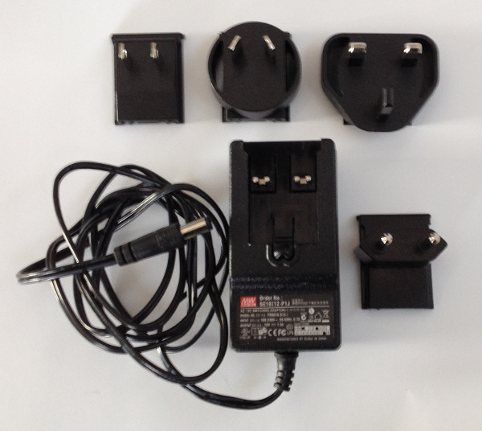
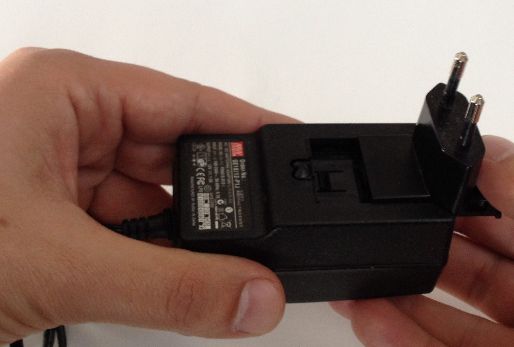
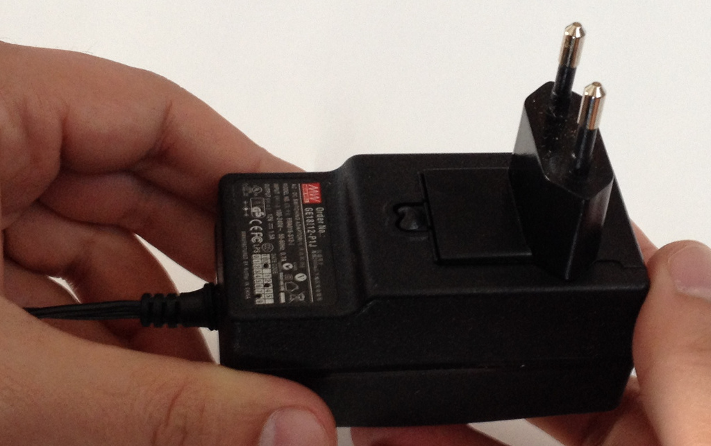

Power-On
========

Tibidabo takes the power from connector **CN19**. The board is shipped with an external
power adapter.

To assemble it, take the power socket adapter compatible with your country, plug it in
the power adapter.

When in position, you should hear a slight *click*.

To power-on the board, just connect the external power adapter to Tibidabo connector *CN19*.
