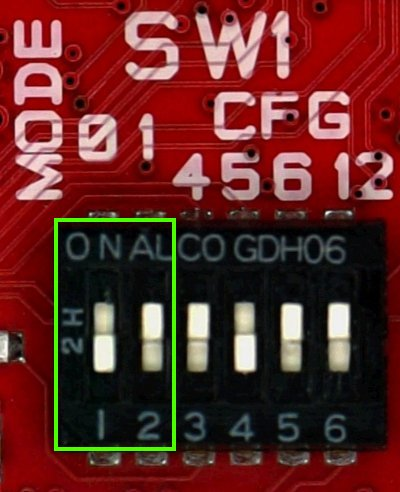
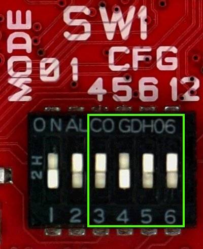

Let's boot
==========

The boot process of an i.MX6 processor is quite complex.
After a Power On Reset (POR) the processor starts executing the internal ROM program.
The boot mode is based on the binary value stored in the internal **BOOT_MODE** register:

==============  =================
BOOT_MODE[1:0]  Boot Type
==============  =================
00              Boot from fuses
01              Serial downloader
10              Internal boot
11              Reserved
==============  =================

**BOOT_MODE[1]** is read from **SRC_BOOT_MODE1** pin (F12). **BOOT_MODE[0]** is read from
**SRC_BOOT_MODE0** pin (C12).

On @board@, switches 1 and 2 of **SW1** let you define the values for **BOOT_MODE** register:

* SW1 switch 1 controls BOOT_MODE[0]

* SW1 switch 2 controls BOOT_MODE[1]

in the image BOOT_MODE[1:0] = 10 (*Internal boot*).

The other switches of SW1 are used for *Internal boot* mode and will be explained later in this chapter.

eFUSEs
------

**eFUSEs** are One Time Programmable (OTP) devices. The On-Chip OTP Controller (OCOTP_CTRL)
manages reads/writes from/to eFUSEs and memory mapping of the values by means of shadow
registers.
You can blow the fuses by means of **u-boot** fuse command, be very careful because **fuses are one time
programmable only**, a mistake will last forever! However, even if you manage to brik the board, you can
always use it with the Serial downloader boot mode.

Boot from FUSEs
---------------

In *boot from fuses mode* the boot ROM uses the fuses values to decide how to boot.
The boot flow is controlled by **BT_FUSE_SEL** eFUSE:
* if 1 the boot ROM will load the bootloader according to the state of eFUSEs,
* if 0 (the device has not yet been programmed) the boot ROM will jump to *serial downloader* mode.
@board@ is shipped with no fuse blown so you can blow the fuses when you think you are ready.

For example, to instruct the processor to boot from **SD card** you can blow the following fuses with
*u-boot* **fuse** command:

::

    fuse prog 0 5 0x00001040
    fuse prog 0 6 0x00000010

where, the first command setup the boot from sd card, while the second command set **BT_FUSE_SEL = 1**.

Again, if you want to instruct the processor to boot from **SPI NOR** you can blow the following fuses:

::

    fuse prog 0 5 0x18000030
    fuse prog 0 6 0x00000010

where the first command setup the boot from serial ROM, and the second command set **BT_FUSE_SEL = 1**.

Serial Downloader
-----------------

*Serial downloader boot mode* tells the processor's boot ROM to load registers configuration and bootloader
from **USB**.
To work with this boot mode you need a micro USB cable to connect the board (connector *CN4*) to your Personal
Computer and a software installed on your PC, speaking of which, if you have a Microsoft Windows operating system
you need Freescale's i.MX6 *Manufacturing Tool* that can be downloaded from:

::

    http://www.freescale.com/webapp/sps/site/prod_summary.jsp?code=IMX6_SW

If you have a Linux operating system instead, you need Boundary Devices *imx_usb_loader* tool that can be obtained
from their git repository:

::

    git://github.com/boundarydevices/imx_usb_loader

To compile *imx_usb_loader* project you need *libusb* installed on your distribution. This is the set of commands
needed on an *Ubuntu* machine to setup the tool:

::

    sudo apt-get install libusb-1.0 libusb-dev libusb-1.0-0-dev
    git clone git://github.com/boundarydevices/imx_usb_loader
    cd imx_usb_loader
    make

Once the tool is ready, power up the board, then you can download your *u-boot.imx* on the board with this command:

::

    ./imx_usb path/to/your/u-boot.imx

Internal Boot
-------------

If **BT_FUSE_SEL = 1** all boot options are controlled by the eFUSEs, if **BT_FUSE_SEL = 0** specific boot configuration
parameters may be set using GPIO pins rather than eFUSEs. The use of GPIOs is intended for **development only**.
If an error occurs, the boot ROM jumps to serial downloader boot mode.
On @board@, **SW1** switches 3, 4, 5, 6 (along with a set of jumpers available on the bottom side of the board) can define
a custom boot mode so you can simulate your configuration before blowing fuses.

=========================  ===============
SW1[6:3] = BOOT_CFG1[6:4]  Boot Device
=========================  ===============
1100                       SD regular boot
1101                       SD fast boot
0011                       Serial NOR
0010                       SATA
=========================  ===============

For example, this is the selection of the boot from SD card (fast boot)

**SW1[6] switch goes right to BOOT_CFG2[4]**. The SD card socket on @board@ is connected to processor's USDHC3, this means
that, if you want to boot from SD card, **BOOT_CFG2[4:3]** should then be set to *10* (USDHC3), therefore you need to set
**SW1[6] = 1** and **R162 must not be mounted**.

.. image:: _static/boot_switches_usdhc3.jpg
    :align: center

.. _bootloader_deploy_label:

Bootloader deploy
-----------------

When you boot with *serial downloader*, you just do:

::

    cd /path/to/imx_usb
    ./imx_usb path/to/your/u-boot.imx

but when you *boot from fuses* or you want to use the *internal boot* you need to understand where the processor looks for the
bootloader binary.
If you want to boot from SPI NOR, you need to write the bootloader binary (*u-boot.imx*) to the flash memory, so you first need
to read into memory a valid bootloader binary (from ethernet, SD card, mSATA or USB), then:

::

    sf probe
    sf erase 0x64000
    sf write $loadaddr 0x400 $filesize

where *loadaddr* is an environment variable where the memory load address is defined, and *filesize* is the size of file 
*u-boot.imx* that has been previously loaded to memory. Be careful, by default the bootloader is configured to save the
environment inside the SD card, not in the flash itself. If you prefer to save the environment inside the SPI NOR, 
open u-boot file:

::

    include/configs/tibidabo.h

define macro **CONFIG_ENV_IS_IN_SPI_FLASH**, comment **CONFIG_ENV_IS_IN_MMC** definition, and recompile the bootloader.

In case you want to boot from SD card, you need to write the bootloader starting at address 1024 on the medium, just inside
the MBR gap. The first partition on the medium must start at an address that leaves enough room for then bootloader and its environment
variables, block 8192 (with block size of 512) will be more then enough (the environment gets written/read on the SD card with an offset of
384KB and will be 8KB large). Good, but how do you write your u-boot binary on the SD card? If you do not care to customize
the bootloader, and you built an image with Yocto/OpenEmbedded, you may have noticed that under the directory where Yocto/OpenEmbedded
puts all the built images there is a file with extension *.sdcard*. Well, such a file is an iso an can be written *as is*
to the SD card device, just:

::

    sudo dd if=/path/to/image.sdcard of=/your/sd/card/device

Once the iso has been written, the SD card will have all you need to make it boot from it (it will have bootloader, kernel image, file system
and kernel modules). Ok, but what if you want to rewrite just the bootload and not the all image? You can overwrite the bootloader on
the SD card always with *dd*:

::

    sudo dd if=/path/to/u-boot.imx of=/your/sd/card/device bs=1k seek=1

Bootscript
----------

Once the bootloader has been properly deployed (see :ref:`bootloader_deploy_label`), you turn on the board, the bootloader gets loaded
and starts running until it gets to the boot command. What happen next? Well, since the board have a lot of options from where to load the kernel
and with which options run the kernel, where is the root file system, which video mode, etc..., you get the best result if you have a simple facility
to customize the system boot process yourself instead of having a milion combinations script that doesn't do exactly what you want it to do.
The facility we are talking about is a simple u-boot script that the default boot command tries to load from, in order, mSATA, SD and tftp.
When u-boot finds it, the script gets executed. That's it. Here is an example of an u-boot script that tries to load the Linux kernel binary
from the SD card first partition (the partition can be FAT, EXT2, EXT3 or EXT4), and tells the kernel to use the second partition of the SD
card as root partition:

::

    setenv bootargs ${bootargs} vmalloc=400M root=/dev/mmcblk0p2 rw,rootwait consoleblank=0 video=mxcfb0:dev=hdmi,1280x720M@60,if=RGB24 video=mxcfb1:dev=lcd,CLAA-WVGA,if=RGB666 fbmem=28M,10M
    mmc dev 0
    for file_system in fat ext2; do
        ${file_system}load mmc 0:1 ${loadaddr} /uImage && bootm ${loadaddr}
    done
    echo Impossible to boot from SD card partition 1

But that is an u-boot script, not the *bootscript*, to make it suitable as a bootscript you need to give it **mkimage** as input first.
If you are not that comfortable with mkimage, you can have a simplified interface offered by `create-bootscript.sh <_static/create-bootscript.sh>`_ script.
The usage is very simple, just run it like this:

::

    ./create-bootscript.sh -i path/to/your/u-boot/script -o /where/to/put/the/generated/bootscript

where parameter *-i* stands for source file to take as input and *-o* stands for "binary" file to emit as output.

Copy the output file to where you want it to be found, that is:

* SD card, first or second partition in the root director

* mSATA, first or second partition in the root directory, or

* TFTP directory on your computer.

.. important::

    Name the script exactly bootscript

