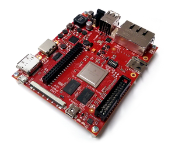

Architech's tibidabo documentation
=======================================

.. only:: html

Welcome to **tibidabo** documentation!

If you are a new user of the **Yocto based SDK** we suggest you to read the

:ref:`quick`

otherwise, if you want to have a better understanding of specific topics, we suggest you to have a look to the documentation chapters:

.. toctree::
  :maxdepth: 2
  :numbered:

  quick
  sdk-architecture
  bsp
  tools
  board
  faq

Furthermore, we encourage you to read the `official Yocto Project documentation <https://www.yoctoproject.org/documentation>`_.
