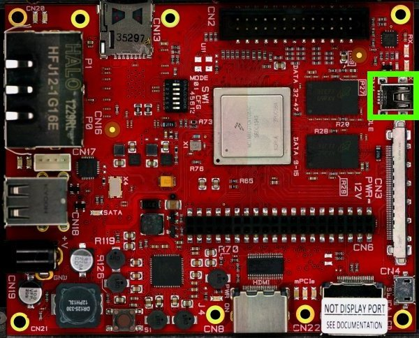

To debug the application connect your Host PC to hachiko Board with an Ethernet cable. Connect the hachiko board to the PC by means of a usb cable to power the board and to have the serial console.

The green rectangle is where to insert the mini-usb connector.
