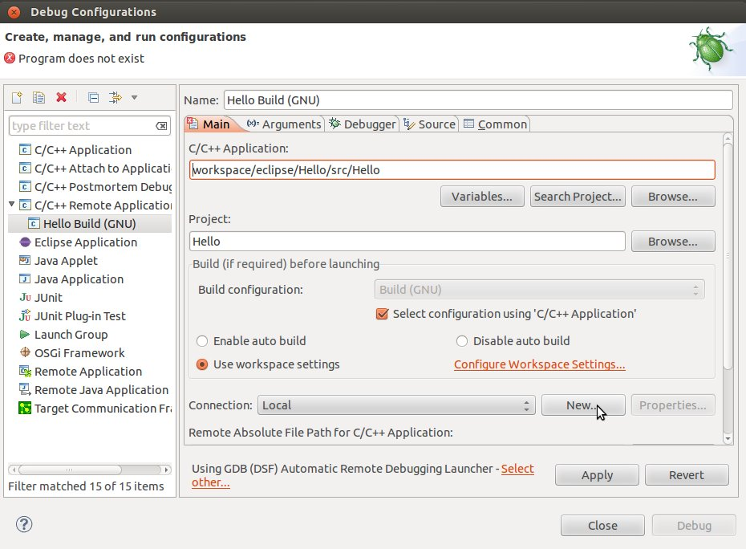
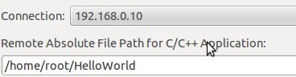

.. _quick:

Quick start guide
^^^^^^^^^^^^^^^^^

This document will guide you from importing the virtual machine to the debugging of an Hello World! example on a customized Linux distribution that you will generate with the Yocto toolchain.

.. include:: vm.rst

Splashscreen Application
========================

1. Start the VM

.. image:: _static/vbStart.png

2. Click on the **Architech SDK** icon on the desktop:

.. image:: _static/splash0.jpg

3. The first screen is composed of two voices, if you click on **ArchiTech** you will be show to the list of the boards installed on the VM. The second voice **3rd Party** is the list boards of other companies.
Clicking on **ArchiTech**.

.. image:: _static/splash1.jpg

4. Select the board where you want develop. Here you have a short description of the boards with a photo.

.. image:: _static/splash2.jpg

5. From the new screen, 

.. image:: _static/splash3.jpg

you can:

* start **HOB** (the graphic interface for bitbake) to customize and build your preferred Linux distribution,
* start **Bitbake** from command line to customize and build your preferred Linux distribution
* select your preferred editor to write your application, that means the **Eclipse IDE** or **Qt Creator**, 
* read this documentation
* update the SDK

Click on **run bitbake**, you will be show a terminal with the enviroment loaded to start to build an image.

Build the core-image-minimal-dev
================================

1. Open with **vim** the file **local.conf**:

::

	$ vi conf/local.conf

2. Go to the end of the file and add the following lines:

::

	EXTRA_IMAGE_FEATURES = "tools-debug"
	IMAGE_INSTALL_append = " tcf-agent"

with these lines will be build in the image the **tcf-agent** and the **gdbserver**.

.. note::

	In vim use this commands to edit the file:
	i	to enter in "insert mode"
	ESC	to esc from "insert mode"
	:w	to save the file
	:q	to exit from vim

	For an useful tutorial use this command on the prompt: vimtutor

3. Build the **core-image-minimal-dev** image with the following command:

::

	$ bitbake core-image-minimal-dev

.. important::

	If the target board is a hachiko-tiny the core-image-minimal-dev is named **tiny-image** so use the command:

	$ bitbake tiny-image

.. note::

	Is required a internet connection to build the image

At the end of the build the image will be automatically saved in *tibidabo/yocto/build/tmp/deploy/images* folder.

8. The next step is copy the image built in *tibidabo/sysroot/* folder:

::

	$ sudo tar -zxvf tmp/deploy/images/tibidabo/core-image-minimal-dev.tgz -C /home/architech/architech_sdk/architech/tibidabo/sysroot/

.. note::

	The sudo password is: **architech**

.. include:: build-sd.rst

Create a HelloWorld project
===========================

1. Now you will create a simple **HelloWorld** using **Eclipse**. Return on **Splashscreen** screen and select the voice **Develop with Eclipse** from the menu of the target board.

.. image:: _static/splash4.jpg

2. Go to *File -> New -> Project* and select *C/C++ -> C Project* then press *next* button.

3. Insert the project name **HelloWorld** and select *Hello World ANSI C Autotools Project* then press *next* button.

.. image:: _static/eclipse-newprj2.jpg

4. Insert *Author* field and click on *Finish* button. Select *Yes* on the "Open Associated Perspective?" question.

5. Build the project from *Project -> Build All*.

Debug the application on the target board
-----------------------------------------

.. include:: poweron-board.rst

On your Host Operating System open a terminal console (ctrl+alt+t) and run command:

::

 minicom -w -s

choose *select port setup* and press **Enter**. Setup the port with the following configuration:

::

 A -    Serial Device      : /dev/ttyUSB0
 B - Lockfile Location     : /var/lock
 C -   Callin Program      :
 D -  Callout Program      :
 E -    Bps/Par/Bits       : 115200 8N1
 F - Hardware Flow Control : No
 G - Software Flow Control : No

once you are done configuring the serial port, you are back to minicom main menu and you can select **exit**.
press the **reset button** on the tibidabo board.
The login will appear inside the terminal of the tibidabo board:

::

 Yocto (Built by Poky 7.0.1) 1.2.1
 ttyO0

 tibidabo login:

.. note::

  sometimes you need press enter to view the login

Insert **root** and press **enter**. run command:

::

  ifconfig eth0 192.168.0.10
  ping 192.168.0.100

If the output is similar to this one:

::

 64 bytes from 192.168.0.100: icmp_req=1 ttl=64 time=0.946 ms                     
 64 bytes from 192.168.0.100: icmp_req=2 ttl=64 time=0.763 ms                     
 64 bytes from 192.168.0.100: icmp_req=3 ttl=64 time=0.671 ms                     
 64 bytes from 192.168.0.100: icmp_req=4 ttl=64 time=0.793 ms

the ethernet connection is ok, then run command:

::

  /etc/init.d/tcf-agent restart

On the Host machine, follow these steps to let **Eclipse** deploy and debug your application:

* Select Run→Debug Configurations...
* In the left area, expand *C/C++Remote Application*.
* Locate your project and select it to bring up a new tabbed view in the *Debug Configurations* Dialog.

* Insert in *C/C++ Application* the path and the name file where is the binary compiled.
* Click on "New" button near the drop-down menu in the *Connection* field.
* Select *TCF* icon.

.. image:: _static/tcf1.jpg

* Insert in *Host Name* and *Connection Name* fields the IP address of the target board. (e.g. 192.168.0.10)

* Then press *Finish*.

* Use the drop-down menu now in the *Connection* field and pick the IP Address you entered earlier.

* Enter the absolute path on the target into which you want to deploy the application. Use the *Browse* button near *Remote Absolute File Path for C/C++Application:* field. No password is needed.

.. image:: _static/remotepath.png

* Enter also in the path the name of the application you want to debug. (e.g. Hello)

* Select *Debugger* tab

.. image:: _static/gdb.jpg

* In GDB Debugger field insert the absoulute path where is located the gdb program of the toolchain. (e.g."/home/architech/architech_sdk/architech/tibidabo/toolchain/sysroots/i686-pokysdk-linux/usr/bin/arm-poky-linux-gnueabi/arm-poky-linux-gnueabi-gdb")

* In *Debugger* window there is the tab named *Shared Library*, click on its.
* Add the libraries path "lib" and "usr/lib" of the rootfs (e.g. "/home/architech/architech_sdk/architech/tibidabo/sysroot/lib"). These libraries must be the same used in the target board.

.. image:: _static/libs.jpg

* Click *Debug* to bring up a login screen and login.
* Accept the debug perspective. 

.. important::

	If debug does not works, check if tcf-agent is running on the board and gdbserver is present.

