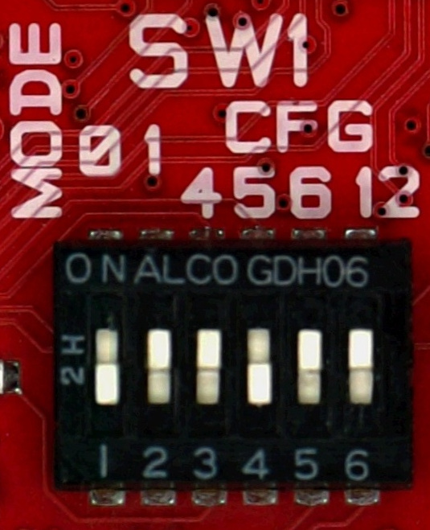

First of all, make sure the board can boot entirely from the micro SD card by setting *SW1* with this configuration

Take the power socket adapter compatible with your country, plug it in the power adapter. When in position, you should
hear a slight *click*. Power on the board connecting the external power adapter to Tibidabo connector **CN19**.

Now it's time to start the serial console.

.. include:: serial_console.rst

Give *root* to the login prompt:

.. board::

 tibidabo login: root

and press *Enter*.

.. note::

 Sometimes, the time you spend setting up minicom makes you miss all the output that leads to the login and you see just a black screen, press *Enter* then to get the login prompt.

