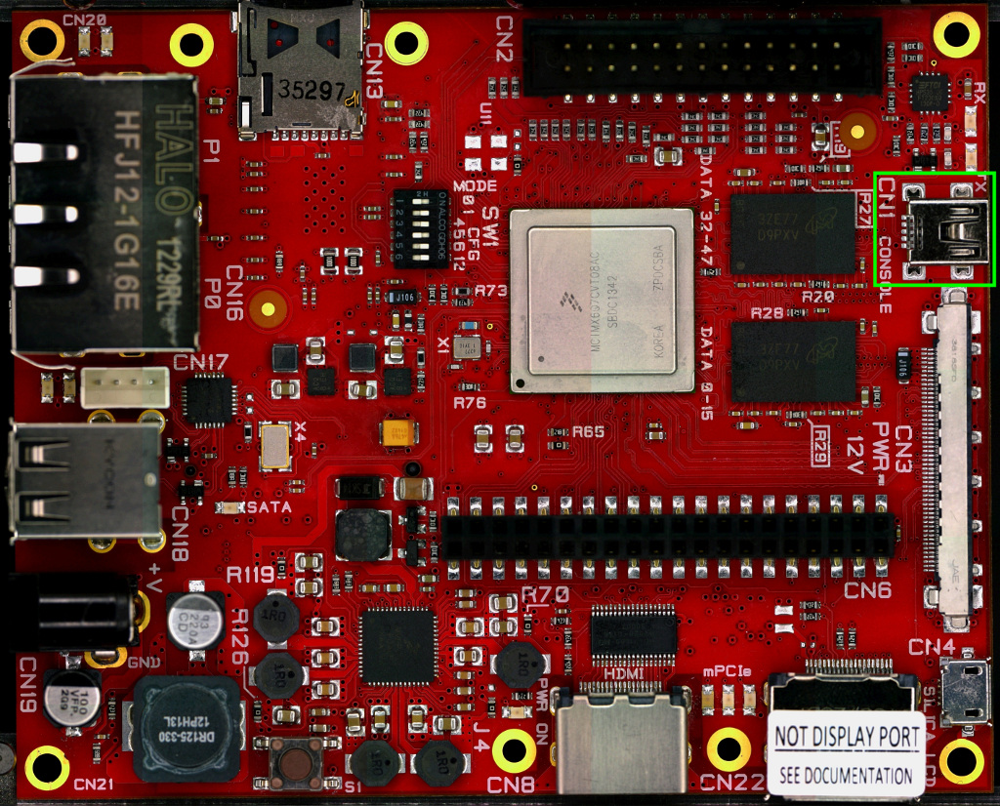

On Tibidabo there is the dedicated serial console connector **CN1**

which you can connect, by means of a mini-USB cable, to your personal computer.

.. note::

 Every operating system has its own killer application to give you a serial terminal interface. In this guide, we are assuming your **host** operating system is **Ubuntu**.

On a Linux (Ubuntu) host machine, the console is seen as a ttyUSBX device and you can access to it by means
of an application like *minicom*.

*Minicom* needs to know the name of the serial device. The simplest way for you to discover
the name of the device is by looking to the kernel messages, so:

1. clean the kernel messages

.. raw:: html

 

 
<b class="admonition-host">&nbsp;&nbsp;Host&nbsp;&nbsp;</b>&nbsp;&nbsp;<a style="float: right;" href="javascript:select_text( 'serial_console_rst-host-121' );">select</a>

 <pre class="line-numbers pre-replacer" data-start="1"><code id="serial_console_rst-host-121" class="language-markup">sudo dmesg -c</code></pre>
 
 
 

2. connect the mini-USB cable to the board already powered-on

3. display the kernel messages

.. raw:: html

 

 
<b class="admonition-host">&nbsp;&nbsp;Host&nbsp;&nbsp;</b>&nbsp;&nbsp;<a style="float: right;" href="javascript:select_text( 'serial_console_rst-host-122' );">select</a>

 <pre class="line-numbers pre-replacer" data-start="1"><code id="serial_console_rst-host-122" class="language-markup">dmesg</code></pre>
 
 
 

3. read the output

.. raw:: html

 

 
<b class="admonition-host">&nbsp;&nbsp;Host&nbsp;&nbsp;</b>&nbsp;&nbsp;<a style="float: right;" href="javascript:select_text( 'serial_console_rst-host-123' );">select</a>

 <pre class="line-numbers pre-replacer" data-start="1"><code id="serial_console_rst-host-123" class="language-markup">[ 2614.290675] usb 3-4: &gt;new full-speed USB device number 4 using xhci_hcd
 [ 2614.313854] usb 3-4: &gt;New USB device found, idVendor=0403, idProduct=6015
 [ 2614.313861] usb 3-4: &gt;New USB device strings: Mfr=1, Product=2, SerialNumber=3
 [ 2614.313865] usb 3-4: &gt;Product: FT230X Basic UART
 [ 2614.313868] usb 3-4: &gt;Manufacturer: FTDI
 [ 2614.313870] usb 3-4: &gt;SerialNumber: DN002OZI
 [ 2614.379284] usbcore: registered new interface driver usbserial
 [ 2614.379298] usbcore: registered new interface driver usbserial_generic
 [ 2614.379306] USB Serial support registered for generic
 [ 2614.379310] usbserial: USB Serial Driver core
 [ 2614.387899] usbcore: registered new interface driver ftdi_sio
 [ 2614.387914] USB Serial support registered for FTDI USB Serial Device
 [ 2614.387997] ftdi_sio 3-4:1.0: &gt;FTDI USB Serial Device converter detected
 [ 2614.388029] usb 3-4: &gt;Detected FT-X
 [ 2614.388031] usb 3-4: &gt;Number of endpoints 2
 [ 2614.388034] usb 3-4: &gt;Endpoint 1 MaxPacketSize 64
 [ 2614.388035] usb 3-4: &gt;Endpoint 2 MaxPacketSize 64
 [ 2614.388037] usb 3-4: &gt;Setting MaxPacketSize 64
 [ 2614.388260] usb 3-4: &gt;FTDI USB Serial Device converter now attached to /dev/ttyUSB0
 [ 2614.388288] ftdi_sio: v1.6.0:USB FTDI Serial Converters Driver</code></pre>
 
 
 

As you can see, here the device has been recognized as **/dev/ttyUSB0**.

Now that you know the device name, run *minicom*:

.. raw:: html

 

 
<b class="admonition-host">&nbsp;&nbsp;Host&nbsp;&nbsp;</b>&nbsp;&nbsp;<a style="float: right;" href="javascript:select_text( 'serial_console_rst-host-124' );">select</a>

 <pre class="line-numbers pre-replacer" data-start="1"><code id="serial_console_rst-host-124" class="language-markup">sudo minicom -ws</code></pre>
 
 
 

If minicom is not installed, you can install it with:

.. raw:: html

 

 
<b class="admonition-host">&nbsp;&nbsp;Host&nbsp;&nbsp;</b>&nbsp;&nbsp;<a style="float: right;" href="javascript:select_text( 'serial_console_rst-host-125' );">select</a>

 <pre class="line-numbers pre-replacer" data-start="1"><code id="serial_console_rst-host-125" class="language-markup">sudo apt-get install minicom</code></pre>
 
 
 

then you can setup your port with these parameters:

.. raw:: html

 

 
<b class="admonition-host">&nbsp;&nbsp;Host&nbsp;&nbsp;</b>&nbsp;&nbsp;<a style="float: right;" href="javascript:select_text( 'serial_console_rst-host-126' );">select</a>

 <pre class="line-numbers pre-replacer" data-start="1"><code id="serial_console_rst-host-126" class="language-markup">+-----------------------------------------------------------------------+
 | A -    Serial Device      : /dev/ttyUSB0                              |
 | B - Lockfile Location     : /var/lock                                 |
 | C -   Callin Program      :                                           |
 | D -  Callout Program      :                                           |
 | E -    Bps/Par/Bits       : 115200 8N1                                |
 | F - Hardware Flow Control : No                                        |
 | G - Software Flow Control : No                                        |
 |                                                                       |
 |    Change which setting?                                              |
 +-----------------------------------------------------------------------+
         | Screen and keyboard      |
         | Save setup as dfl        |
         | Save setup as..          |
         | Exit                     |
         | Exit from Minicom        |
         +--------------------------+</code></pre>
 
 
 

If on your system the device has not been recognized as */dev/ttyUSB0*, just replace */dev/ttyUSB0*
with the proper device.

Once you are done configuring the serial port, you are back to *minicom* main menu and you can select *exit*.
