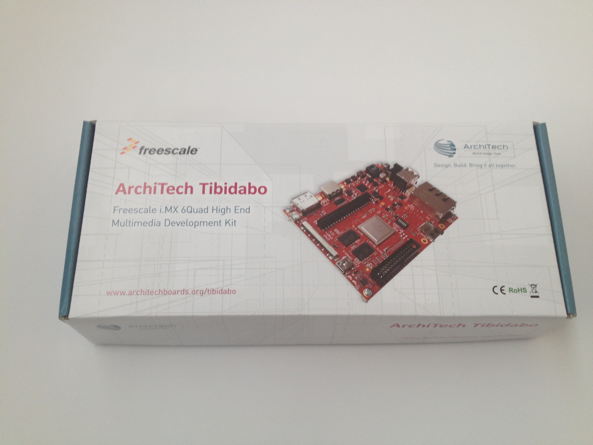
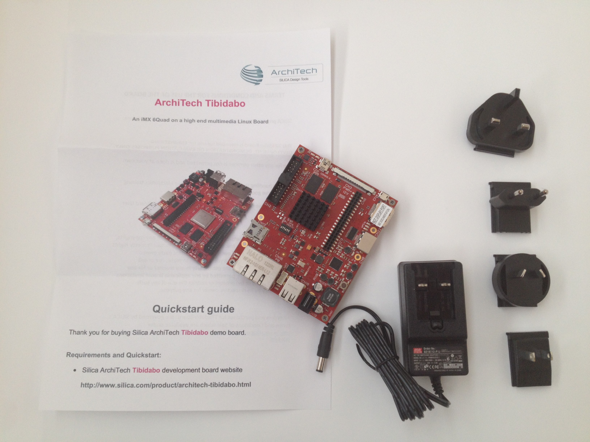
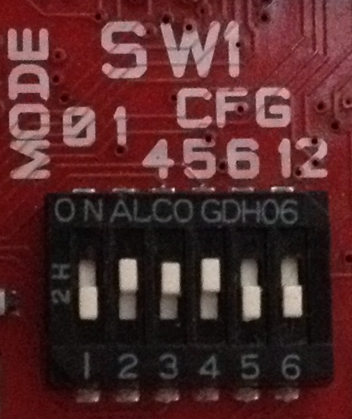

.. _unboxing_label:

Unboxing
^^^^^^^^

This powerful board comes with this beautiful box

Tibidabo feeds its horses by means of an external power supply, which is included in the package and has several socket adapters.

The SPI NOR on the board has been programmed to let Tibidabo boot a *core-image-minimal* image generated with *Yocto*.

What are we waiting for? Lets boot the board!

1. First of all, make sure SW1 has this configuration

 

2. Connect the HDMI connector (**CN8**) to your monitor/television by means of an HDMI cable

3. Connect a USB keyboard to the board (connector **CN18**)

4. Take the socket adapter compatible with your country, plug it in the power adapter. When in position, you should hear a slight *click*

5. Power on the board connecting the external power adapter to Tibidabo connector **CN19**

6. The login is **root**

Enjoy!
